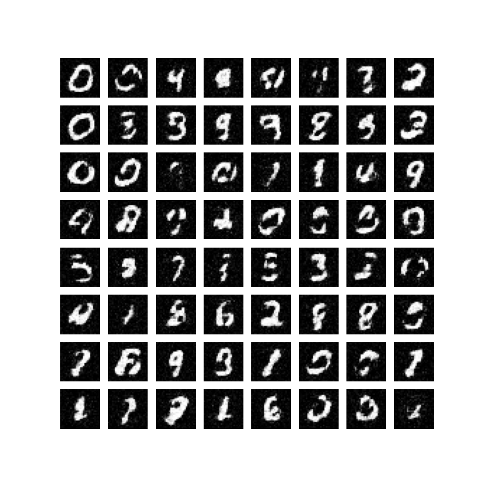
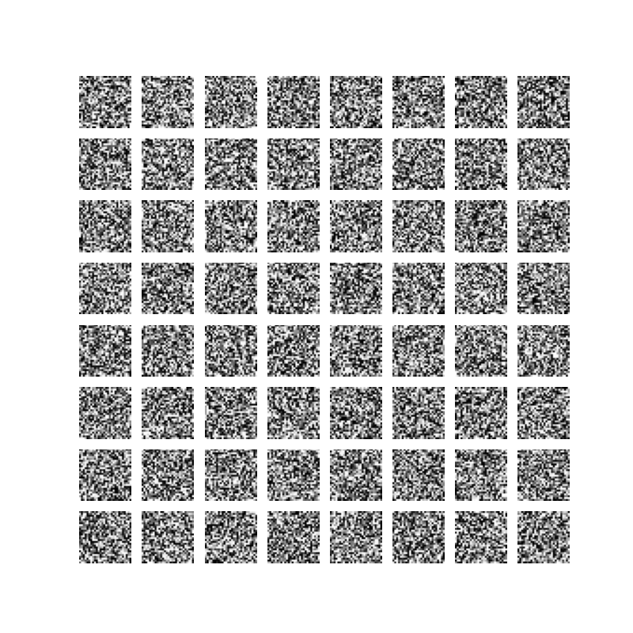
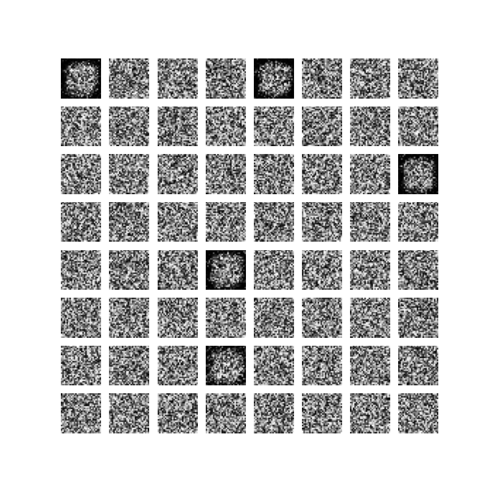
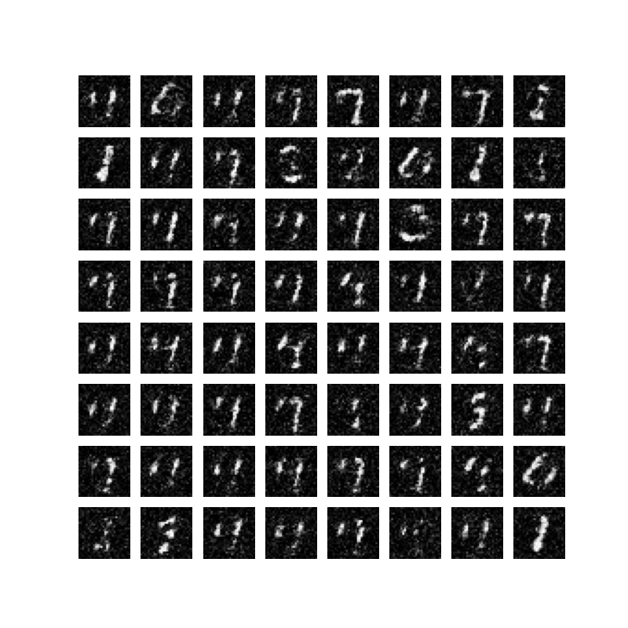
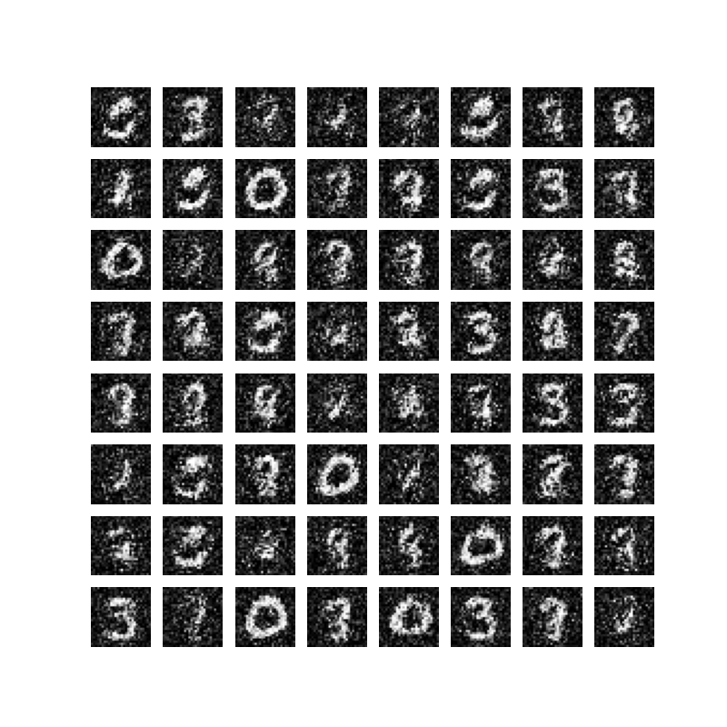

# An Iterative Journey of Training an EBM on MNIST

This repository documents the process of building and debugging an Energy-Based Model (EBM) to generate MNIST digits. It showcases the common pitfalls and the iterative solutions required to achieve stable training and diverse sample generation.

## Final Result: High-Fidelity Samples

After successful training and a long MCMC chain for generation, the model is capable of producing diverse and recognizable digits.



---

## The Research Journey

This project progressed through several key stages, each addressing a specific failure mode.

### Experiment 1: Initial Attempt & Gradient Error
- **Script:** `src/01_initial_attempt.py`
- **Problem:** The MCMC sampling was performed inside a `torch.no_grad()` block, preventing the calculation of energy gradients needed for Langevin Dynamics.
- **Result:** `RuntimeError: element 0 of tensors does not require grad...`

### Experiment 2: Loss Collapse (Trivial Minimum)
- **Script:** `src/02_loss_collapse.py`
- **Problem:** A poorly scaled energy regularizer `(E_pos**2 + E_neg**2)` created a trivial mathematical minimum at `E_pos=-1, E_neg=1`. The model learned to output these constant values regardless of input.
- **Result:** Loss stuck at `-1.0`, and generated samples were pure noise.


### Experiment 3: Blob Collapse
- **Script:** `src/03_blob_collapse.py`
- **Problem:** After scaling the regularizer, the model found the next-easiest solution: mapping fuzzy blobs to a low energy value (`-5`) and everything else to a high one (`+5`). The MCMC sampler was not strong enough to produce challenging negative samples.
- **Result:** Loss stuck at `-5.0`, and generated samples were fuzzy blobs.


### Experiment 4: Mode Collapse
- **Script:** `src/04_mode_collapse.py`
- **Problem:** With a stronger MCMC sampler (`CD_K=60`) and a better regularizer (R1 penalty), the model began to learn real digits. However, the replay buffer created a feedback loop, causing the model to get "stuck" generating only one or two types of digits.
- **Result:** Generated samples showed low diversity (e.g., mostly '7's).


### Experiment 5: Final Successful Training
- **Script:** `src/05_final_training.py`
- **Problem Solved:** By increasing MCMC noise and the frequency of re-initializing chains from random noise, the mode collapse feedback loop was broken.
- **Result:** Stable training and diverse sample generation across all digit classes.


---

## How to Run

1.  **Clone the repository:**
    ```bash
    git clone https://github.com/YOUR_USERNAME/EBM-MNIST-Journey.git
    cd EBM-MNIST-Journey
    ```

2.  **Set up the environment:**
    ```bash
    # Create a virtual environment (optional but recommended)
    python -m venv env
    source env/bin/activate 

    # Install dependencies
    pip install -r requirements.txt
    ```

3.  **Run the final training:**
    This will train the model from scratch and save the final model as `ebm_final.pth` in its output directory.
    ```bash
    python src/05_final_training.py
    ```

4.  **Generate high-fidelity samples from the trained model:**
    Make sure the path to the model in the script is correct.
    ```bash
    python src/generate_samples.py
    ```